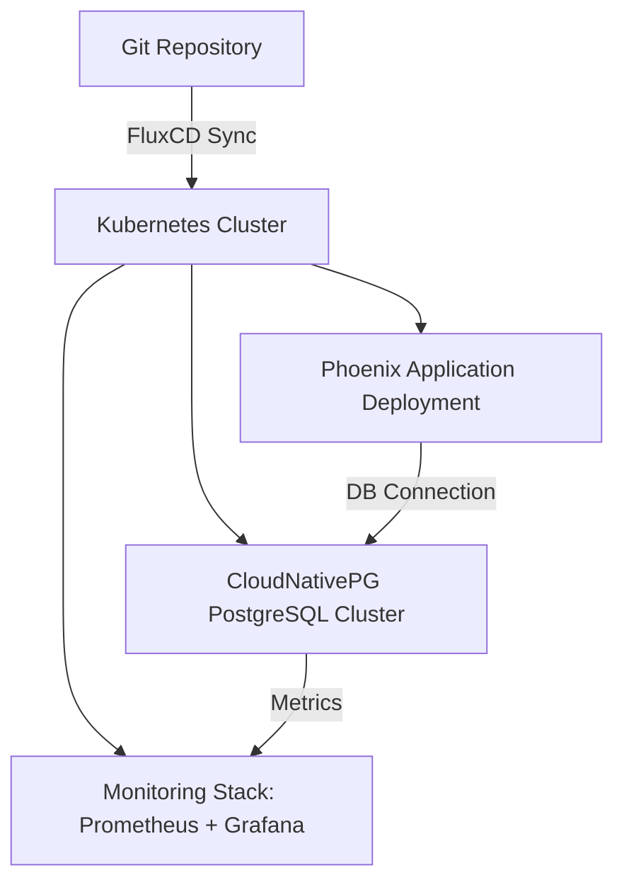

# GitOps-Managed Phoenix Application

This repository contains the infrastructure and deployment setup for a **Phoenix-based web application** using **GitOps principles**. The entire environment, including the application, database, and monitoring stack, is managed declaratively in Git via **FluxCD**.

 

## Architecture Overview



**Components:**

* **Phoenix Application:** Containerized web app, deployed via Helm chart.
* **PostgreSQL:** Managed by **CloudNativePG operator**.
* **Monitoring:** Prometheus scrapes metrics from PostgreSQL and app; Grafana provides dashboards.
* **GitOps Engine:** **FluxCD** watches this repository and applies changes automatically.

 

## Prerequisites

* [kubectl](https://kubernetes.io/docs/tasks/tools/)
* [Minikube](https://minikube.sigs.k8s.io/docs/start/) (or kind/k3d)
* [Helm](https://helm.sh/docs/intro/install/)
* [FluxCD CLI](https://fluxcd.io/docs/cmd/)
* [Docker](https://www.docker.com/get-started)
* Internet access to pull public images and charts

 

## Cluster Setup

**Using Minikube:**

```bash
# Start Minikube cluster
minikube start --driver=docker --cpus=4 --memory=8192

# Verify cluster
kubectl get nodes
```

For Minikube dashboard (optional):

```bash
minikube dashboard
```

 

## GitOps: FluxCD Setup

```bash
# Install FluxCD CLI
brew install fluxcd/tap/flux  # macOS

# Bootstrap Flux to watch this repo
flux bootstrap github \
  --owner=<your-github-username> \
  --repository=<repo-name> \
  --branch=main \
  --path=clusters/phoenix-dev
```

Flux will now automatically apply all manifests and Helm releases from this repository.

 

## Database: CloudNativePG

**Install CloudNativePG operator:**

```bash
Installed via flux
```

**Provision PostgreSQL cluster:**

```yaml
# clusters/postgres.yaml
apiVersion: postgresql.cnpg.io/v1
kind: Cluster
metadata:
  name: phoenix-db
spec:
  instances: 1
  postgresql:
    version: "15"
  storage:
    size: 1Gi
```

**Credentials:** Managed via Kubernetes secrets and injected into the application. Do **not** hardcode credentials in Helm charts.

 

## Monitoring Stack

**Install kube-prometheus-stack via Helm:**

```bash
Installed via flux
```

**Grafana Dashboard:**

* Installed a CloudNativePG dashboard from [Grafana.com](https://grafana.com/grafana/dashboards/)
* Shows metrics like replication, connection count, CPU/memory, query performance.

**Prometheus:** Configured to scrape metrics from PostgreSQL pods.

## Phoenix Application Deployment

1. **Dockerize Application:**

```dockerfile
# Stage 1: Node assets
FROM node:22.18.0-bookworm-slim AS assets

WORKDIR /app/assets

RUN apt-get update && apt-get install -y build-essential \
  && rm -rf /var/lib/apt/lists/*

COPY assets/package.json assets/yarn.lock ./
RUN yarn install && yarn cache clean
COPY assets ./assets

# Ensure priv/static exists
RUN mkdir -p /app/priv/static

###############################################################################
# Stage 2: Elixir dev
FROM elixir:1.18.4-slim AS dev

WORKDIR /app

RUN apt-get update && apt-get install -y build-essential curl inotify-tools \
    && rm -rf /var/lib/apt/lists/*

# Install Hex & Rebar
RUN mix local.hex --force && mix local.rebar --force

# Copy mix files & get deps
COPY mix.* ./
RUN mix deps.get

# Copy config and compile deps
COPY config/config.exs config/dev.exs config/
RUN mix deps.compile

# Copy the rest of the app
COPY . .

# Copy compiled assets from Node stage
COPY --from=assets /app/priv/static /app/priv/static

ENTRYPOINT ["/app/bin/docker-entrypoint-web"]

EXPOSE 4000
CMD ["mix", "phx.server"]


```

2. **Build & Push Docker Image:**

```bash
docker build -t <your-dockerhub-username>/phoenix-app:latest .
docker push <your-dockerhub-username>/phoenix-app:latest
```

3. **Create Helm Chart:**

* `charts/phoenix-app/` contains Deployment, Service, and Secret templates.
* Configurable via `values.yaml`:

tree for repo

```
├── clusters
│   └── minikube
│       ├── apps
│       │   ├── kustomization.yaml
│       │   ├── namespace-pg.yaml
│       │   ├── pg-cluster.yaml
│       │   ├── pg-kustomization.yaml
│       │   ├── pheonix-app
│       │   │   ├── Chart.yaml
│       │   │   ├── templates
│       │   │   │   ├── deployment.yaml
│       │   │   │   ├── _helpers.tpl
│       │   │   │   ├── ingress.yaml
│       │   │   │   ├── secret.yaml
│       │   │   │   └── service.yaml
│       │   │   └── values.yaml
│       │   └── pheonix-helmrelease.yaml
│       ├── flux-system
│       │   ├── gotk-components.yaml
│       │   ├── gotk-sync.yaml
│       │   └── kustomization.yaml
│       ├── infra
│       │   ├── database
│       │   │   ├── helmrelease-cnpg.yaml
│       │   │   ├── helmrepo-cnpg.yaml
│       │   │   └── kustomization.yaml
│       │   └── monitoring
│       │       ├── kustomization.yaml
│       │       ├── namespace-monitoring.yaml
│       │       ├── pg-service-monitor.yaml
│       │       ├── postgres-exporter.yaml
│       │       ├── prometheus-release.yaml
│       │       └── prom-repo.yaml
│       └── infra-db-kustomization.yaml
└── README.md

```

4. **Deploy via Flux:**

* Helm chart is committed under `clusters//minikube/apps/phoenix-app/` and automatically synced by Flux.

 

## Alerting (Bonus)

**Alert when application pod is not Ready > 1 min:**

```
could not finish this
```
 

## Contributing / Idempotency

* All infrastructure is declaratively defined. Applying multiple times is safe.
* Follow GitOps principle: **the repository is the single source of truth**.
* Changes to `values.yaml` or Helm templates will automatically propagate via Flux.


## References

* [Phoenix Framework](https://phoenixframework.org/)
* [kube-prometheus-stack]\([https://github.com/prometheus-community/helm-charts/tree/main/charts/kube-promethe](https://github.com/prometheus-community/helm-charts/tree/main/charts/kube-promethe)
